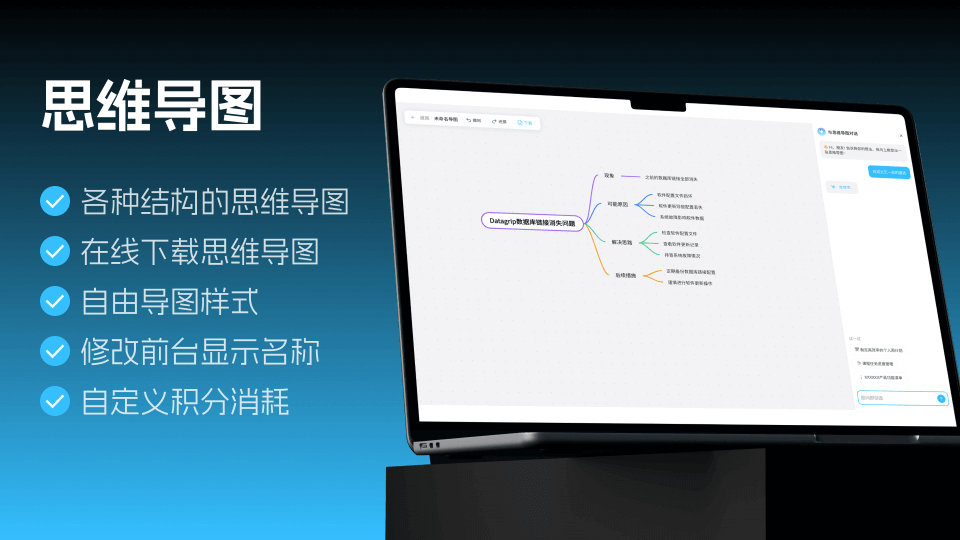
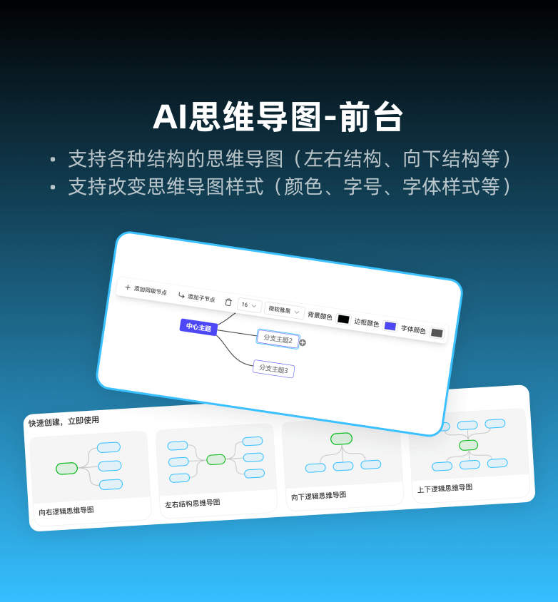
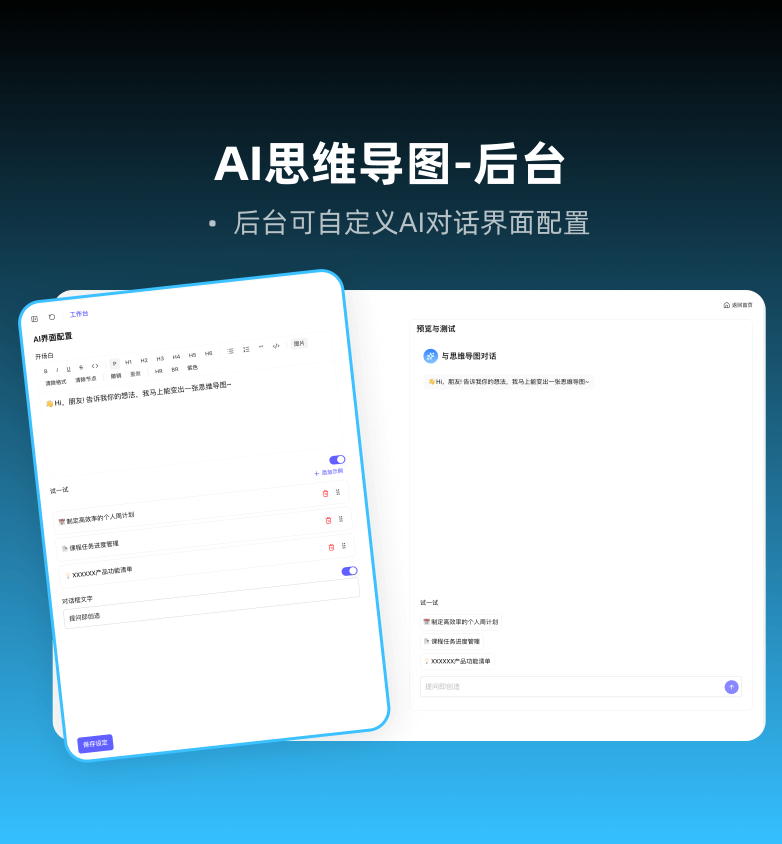
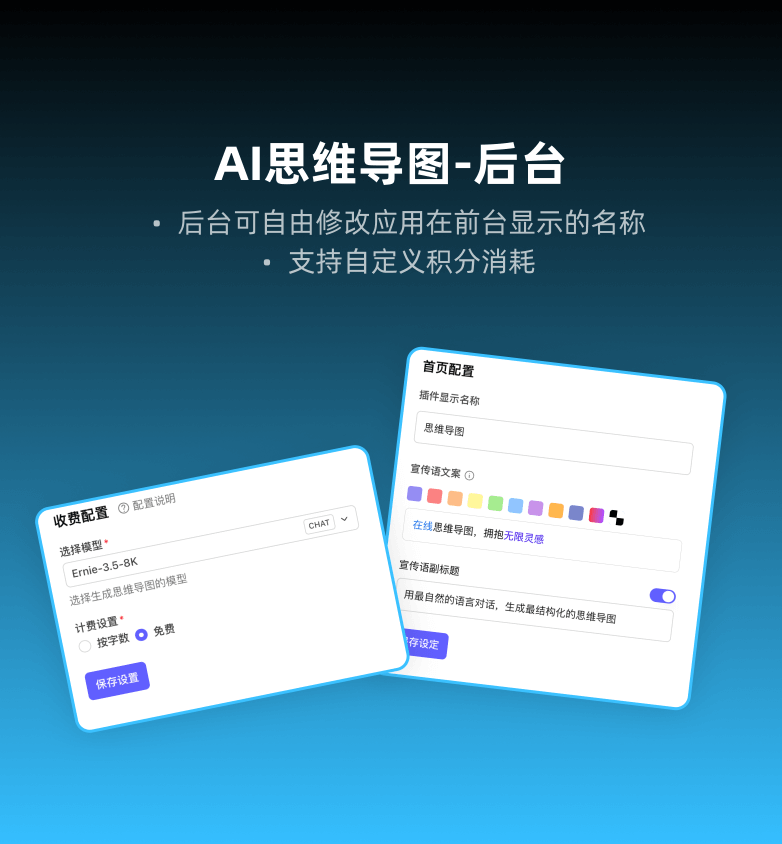
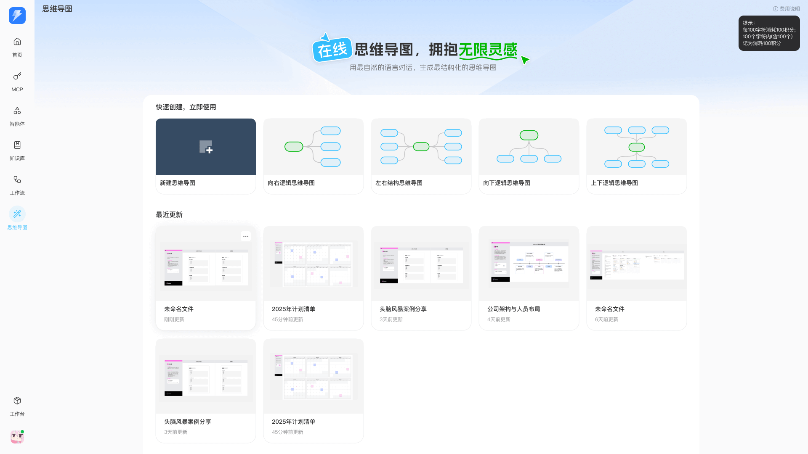
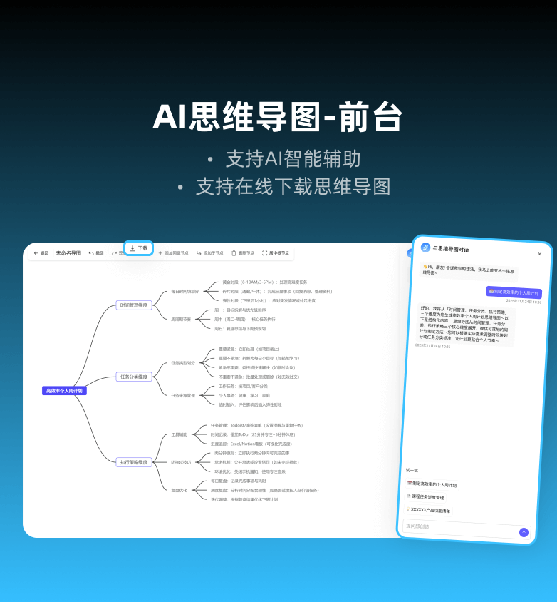
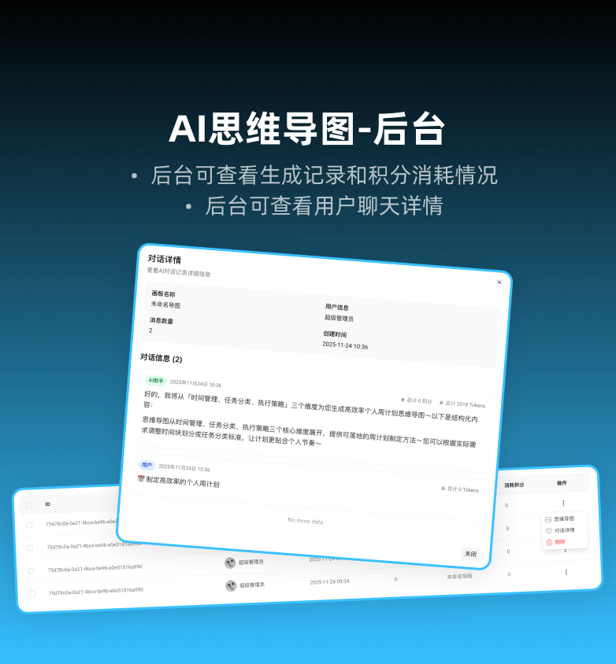
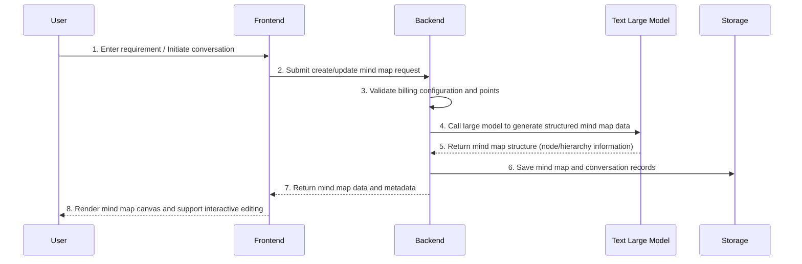

<p align="center">
  <br />
  <br />
  
</p>

<h1 align="center">AI Mind Map Extension (BuildingAI Mind Map)</h1>

<p align="center">
  
  
  
  
</p>

<p align="center">
  <a href="https://www.buildingai.cc/plugin" target="_blank"><strong>Visit App Store Now</strong></a>
</p>

<p align="center">
  <strong>An intelligent extension that can generate editable mind maps through natural language conversation, bringing inspiration and structure together in one step.</strong>
</p>

<p align="center">
  <em>Supports multiple layout structures, AI conversation generation, visual editing, record management, and fine-grained backend configuration</em>
</p>

<p align="center">
  
  
  
</p>

---

## Table of Contents

- [Interface Preview](#interface-preview)
- [Product Introduction](#product-introduction)
  - [What is AI Mind Map Extension](#what-is-ai-mind-map-extension)
  - [Core Value](#core-value)
  - [Use Cases](#use-cases)
- [Features](#features)
- [Technical Architecture](#technical-architecture)
  - [Tech Stack](#tech-stack)
  - [Core Workflow](#core-workflow)
- [User Manual](#user-manual)
  - [User Guide](#user-guide)
  - [Admin Console Configuration](#admin-console-configuration)
- [Points and Billing](#points-and-billing)
- [FAQ](#faq)
- [License](#license)
- [Contact Us](#contact-us)

---

## Interface Preview

### Homepage Entry and Quick Creation

The homepage provides multiple commonly used mind map layouts for quick one-click creation:

- Blank mind map
- Rightward logical mind map
- Left-right structure mind map
- Downward logical mind map
- Fishbone diagram

<p align="center">
  
</p>

### AI Creation and Editing Canvas

In the creation page, you can quickly generate structured mind maps through AI conversation, or drag to edit, add nodes, set colors, etc.

<p align="center">
  
</p>

### Records and Conversation Details

The system records every mind map generation and AI conversation process, supporting viewing mind map previews, conversation details, points consumption, and other information in the backend.

<p align="center">
  
</p>

---

## Product Introduction

### What is AI Mind Map Extension

**BuildingAI Mind Map** is an AI mind map tool integrated into the BuildingAI platform.  
Users only need to describe ideas in natural language or gradually refine requirements in conversation, and the system can automatically generate clear, editable mind maps to help you quickly organize thoughts, break down tasks, and plan projects.

### Core Value

| Value Point | Description |
|-------------|-------------|
| Natural Language Generation | Describe requirements directly through conversation, AI automatically generates structured mind maps |
| Multiple Layout Support | Provides rightward, downward, left-right, fishbone diagram, and other layouts, adapting to different thinking styles |
| Visual Editing | Supports node addition/deletion, content editing, color adjustment, and other operations |
| Record Accumulation | Automatically saves mind maps and conversation records for easy review and re-editing |
| Easy Operations | Backend can configure models, billing rules, homepage copy, and conversation examples to meet different business scenarios |

### Use Cases

- Personal Efficiency: Weekly planning, habit building, time management
- Learning Planning: Course knowledge structure, exam review outlines
- Products and Projects: Feature breakdown, Roadmap planning, requirement organization
- Business Solutions: Marketing campaign planning, solution structure design
- Team Collaboration: Brainstorming notes, structured meeting minutes

---

## Features

### Core Features

| Feature | Description |
|---------|-------------|
| AI-Generated Mind Maps | Enter natural language descriptions or communicate in multiple rounds in conversation, AI automatically generates mind map structure |
| Multiple Mind Map Layouts | Supports blank canvas, rightward logical diagram, left-right structure diagram, downward logical diagram, fishbone diagram, etc. |
| Visual Mind Map Editing | Supports adding sibling nodes, adding child nodes, deleting nodes, undo/redo, center root node, etc. |
| Style Adjustment | Supports setting background color, border color, font color to distinguish levels and highlights |
| Export and Download | Can export mind maps as images for easy sharing and archiving |

### AI Conversation Capabilities

| Capability | Description |
|-----------|-------------|
| Chat with Mind Map | Chat with AI in the side conversation drawer, adjust or generate new mind map structures in real-time |
| Conversation Examples | Can configure multiple "Try It" example questions to help users get started quickly |
| Conversation Records | Backend can view detailed conversation content and message counts for troubleshooting and optimizing dialogue |

### Management and Configuration Capabilities

| Module | Description |
|--------|-------------|
| Record Management | View user generation records, mind map previews, points consumption, and other information, supports batch deletion |
| Model and API Key Configuration | Supports selecting different large models, configuring API keys, and prompts on how to activate on third-party platforms |
| Billing Configuration | Supports per-time/per-character billing, configure points consumed per time or per 100 characters |
| Copy and Homepage Customization | Configure homepage display name, tagline, description, etc., supports rich text and color settings |
| Conversation Interface Configuration | Configure opening lines, example questions, dialog prompt text, etc., to improve new user experience |

---

## Technical Architecture

### Tech Stack

- Frontend Framework: Nuxt 3 + Vue 3 + TypeScript
- UI Components: BuildingAI UI Component Library
- State Management & Tools: Pinia + Composition API + Built-in hooks
- Backend Framework: NestJS
- Database: PostgreSQL + TypeORM
- Cache & Tasks: Redis (relies on main site configuration)
- Storage Service: Local file storage / Object storage (according to main site configuration)

### Core Workflow

#### AI Mind Map Generation Flow



#### Detailed Steps

1. User selects mind map layout on homepage or opens existing mind map.
2. User enters requirement in AI dialog (e.g., "Help me design a feature list for a product plan").
3. Frontend sends request together with current mind map context to backend.
4. Backend selects corresponding model and API key according to configuration, checks if points are sufficient according to billing strategy.
5. Call large model services like Wenxin/Kimi to generate mind map structured data.
6. Backend stores mind map data and conversation records in database together.
7. Frontend updates mind map canvas according to returned data, displaying the latest structure.

---

## User Manual

### User Guide

#### Step 1: Enter Mind Map Page

Click "Mind Map" in the navigation bar or app list to enter the extension homepage.  
The homepage will display "Quick Create" entry and "Recently Updated" mind map list.

#### Step 2: Select Mind Map Layout and Create

- Select a layout on the homepage (blank / rightward / left-right / downward / fishbone diagram).
- Click "Create Mind Map" to enter the editing page.
- Name the mind map (can be renamed on homepage or creation page).

#### Step 3: Generate Mind Map with AI Conversation

- Open the right side "Chat with Mind Map" drawer.
- Enter requirements directly or select preset "Try It" examples.
- After waiting for AI response, the system will generate or update mind map structure according to conversation content.

Conversation Examples:

```
📅 Create an efficient personal weekly plan
📄 Course task progress management
💡 XXXXXX product feature list
```

#### Step 4: Edit and Beautify Mind Map

On the canvas, you can perform the following operations:

- Add sibling nodes / child nodes
- Delete nodes
- Undo / redo operations
- Center root node
- Adjust background color, border color, font color, etc.

#### Step 5: Save and Download

- Mind map content will be automatically saved periodically or during key operations.
- Can download current mind map as an image for reporting, sharing, or archiving.
- In the homepage "Recently Updated", you can quickly open recently edited mind maps.

### Admin Console Configuration

Administrators can perform global configuration and data management for the Mind Map extension in the backend console.

#### 1. Billing and Model Configuration

Path: `Console → Mind Map → Billing Configuration`

Supported configurations:

- Select large model (text large model provider)
- Select corresponding API key
- Billing method: Per time / Per character
- Points consumed per time, points consumed per 100 characters, etc.

#### 2. Conversation Interface Configuration

Path: `Console → Mind Map → Conversation Interface Configuration`

- Configure opening line copy (e.g., "👋 Hi, friend! Tell me your idea, and I'll create a mind map for you right away~").
- Configure "Try It" example question list.
- Configure dialog prompt text (e.g., "Ask to Create").

#### 3. Homepage Customization Configuration

Path: `Console → Mind Map → Homepage Customization`

- Configure extension frontend display name.
- Configure tagline main copy and subtitle (supports rich text and multi-line color settings).
- Real-time preview of homepage display effect.

#### 4. Record Management and Conversation Details

Path: `Console → Mind Map → Generation Records`

- Search generation records by user ID, keywords.
- View mind map preview images, points consumption, creation time, and other information.
- View AI conversation details corresponding to a specific generation.
- Support single deletion and batch deletion.

---

## Points and Billing

Mind Map extension supports flexible points billing strategies (can also be configured as completely free mode):

- **Per-time Billing**: Each mind map generation consumes a fixed amount of points.
- **Per-character Billing**: Charges based on user input content length (every 100 characters as a billing unit).
- Supports adjusting billing rules for different activities or phases.

The frontend page will display the current billing method and prompt text through the "Cost Description" module, helping users use points reasonably.

---

## FAQ

### Q1: What to do if AI cannot generate mind maps

Possible causes and handling suggestions:

- Network exception or model service unavailable: Retry later or contact administrator.
- Model or API key configuration error: Please ask administrator to check model and API key settings in backend "Billing Configuration".
- Insufficient user points: Replenish points in personal center or points page and retry.

### Q2: Mind map structure doesn't meet expectations

Optimization suggestions:

- Clearly state goals and structure hierarchy in conversation, e.g., "Please break down in three-layer structure".
- Ask step by step, breaking complex requirements into multiple sub-questions.
- When unsatisfied with AI generation results, you can manually edit nodes for fine-tuning.

### Q3: Mind map download fails

Troubleshooting steps:

- Check current browser network and storage permissions.
- Try retrying in different browsers or incognito mode.
- Check backend logs for export failure error messages.

### Q4: How to view user conversation details

Administrators can click the "Conversation Details" entry for a record in the backend "Generation Records" page to view complete AI conversation content and message list.

---

## License

This project is released under the BuildingAI License and can only be used and developed within the BuildingAI ecosystem in accordance with relevant agreements.

---

## Contact Us

- App Store: [https://www.buildingai.cc/plugin](https://www.buildingai.cc/plugin)
- Author: BuildingAI Teams-dserha

<p align="center">
  <strong>Online mind maps, embrace infinite inspiration.</strong>
</p>
